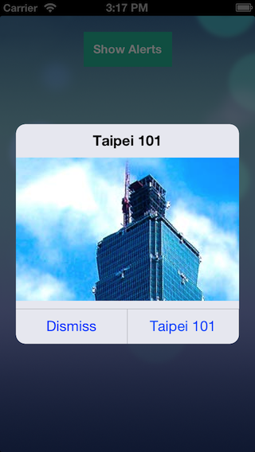
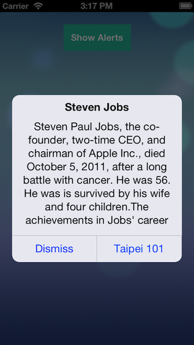
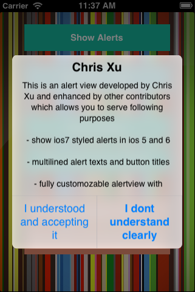

CXAlertView
===========

Version 1.1.0

* Replace `LiveFrost` by native blur function
* Simulate appearance in iOS7.1
* Bug fix

Version 1.0.1

>You cannot customize the appearance of alert views.' - [iOS 7 Design Resources ](https://developer.apple.com/library/ios/documentation/UserExperience/Conceptual/UIKitUICatalog/UIAlertView.html#//apple_ref/doc/uid/TP40012857-UIAlertView-SW1)

If you ever try to mess up with the UIAlertView, it is easy. Go to add at least five buttons on it. Therefore We change the layout with buttons.

This is a custom alert view developed by Chris Xu and enhanced by other contributors which allows you to following things
 * Show ios7 styled alerts in ios 5 and 6.

	
 * Unlike iOS 6 and below , on IOS 7 is non-customisable i.e., you can't modify to customise it. This alert allows you to Add view as you like in iOS7.

	

 * Multilined alert texts and button titles.
 
	
 * Fully customizable alertview with interchangable colors,radiuses,fonts..etc.

---


##Installation

* CocoaPods add `pod 'CXAlertView'`

* If using as a git submodule, you will also need to add [LiveFrost](https://github.com/radi/LiveFrost.git)

##How to use
---

```Objective-C
// Create
- (id)initWithTitle:(NSString *)title message:(NSString *)message cancelButtonTitle:(NSString *)cancelButtonTitle;
- (id)initWithTitle:(NSString *)title contentView:(UIView *)contentView cancelButtonTitle:(NSString *)cancelButtonTitle;
// Buttons
- (void)addButtonWithTitle:(NSString *)title type:(CXAlertViewButtonType)type handler:(CXAlertViewHandler)handler;
- (void)setDefaultButtonImage:(UIImage *)defaultButtonImage forState:(UIControlState)state NS_AVAILABLE_IOS(5_0) UI_APPEARANCE_SELECTOR;
// AlertView action
- (void)show;
- (void)dismiss;
// Operation
- (void)cleanAllPenddingAlert;
```

#####There are three parts of alertview, Top (Title View), Middle (Content View) and Bottom (Buttons Container). 
 
 * `showButtonLine` show buttons dividing line.
 * `showBlurBackground` use blur background.
 
##Next
---

 * Replace blur function by `UIVisualEffect` in iOS8
 * Bug fix.
 
 
##Thanks
---
 * [SIAlertView](https://github.com/Sumi-Interactive/SIAlertView) for some tips to build this.

##Support
---
 * Xcode 5
 * Framework : QuartzCore, Accelerate
 * ARC

##Contact
---
#### Chris Xu

 * [@GitHub](https://github.com/ChrisXu1221)
 * [@Twitter](https://twitter.com/taterctl)
 * [@Mail](mailto:taterctl@gmail.com)

##License
---
Copyright (c) 2013 Chris Xu, Licensed under the MIT license (http://www.opensource.org/licenses/mit-license.php)

Permission is hereby granted, free of charge, to any person obtaining a copy of this software and associated documentation files (the ‘Software’), to deal in the Software without restriction, including without limitation the rights to use, copy, modify, merge, publish, distribute, sublicense, and/or sell copies of the Software, and to permit persons to whom the Software is furnished to do so, subject to the following conditions:

The above copyright notice and this permission notice shall be included in all copies or substantial portions of the Software.

THE SOFTWARE IS PROVIDED ‘AS IS’, WITHOUT WARRANTY OF ANY KIND, EXPRESS OR IMPLIED, INCLUDING BUT NOT LIMITED TO THE WARRANTIES OF MERCHANTABILITY, FITNESS FOR A PARTICULAR PURPOSE AND NONINFRINGEMENT. IN NO EVENT SHALL THE AUTHORS OR COPYRIGHT HOLDERS BE LIABLE FOR ANY CLAIM, DAMAGES OR OTHER LIABILITY, WHETHER IN AN ACTION OF CONTRACT, TORT OR OTHERWISE, ARISING FROM, OUT OF OR IN CONNECTION WITH THE SOFTWARE OR THE USE OR OTHER DEALINGS IN THE SOFTWARE.
